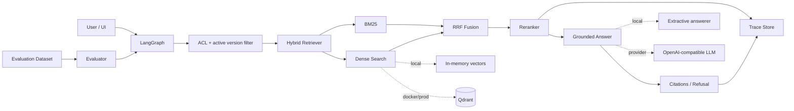

# RAGOps Studio

A public, production-oriented RAG portfolio project focused on the parts that are usually missing from chatbot demos: **hybrid retrieval, citations, access control, document versioning, evaluation, and traceability**.

> This repository uses a fictional e-commerce support knowledge base so the full system can be shown publicly without exposing employer or client data.

## Why this project exists

Most RAG demos stop at `upload -> embed -> vector search -> answer`. RAGOps Studio is designed to show the engineering work required around that happy path:

- hybrid **BM25 + dense retrieval**
- **RRF** rank fusion and a reranking layer
- citation-first grounded responses and a refusal route
- document checksum deduplication and active-version switching
- role-aware retrieval before ranking
- trace IDs with per-stage latency and component scores
- offline evaluation with **Recall@K, MRR, nDCG@K**, and answer keyword coverage
- zero-key local mode plus optional **OpenAI-compatible + Qdrant** mode
- FastAPI API, LangGraph orchestration wrapper, React/TypeScript dashboard

## Architecture



## Demo behaviors worth inspecting

### 1. Hybrid retrieval with explainable scores

Each trace records dense similarity, BM25 score, RRF score, and rerank score for retrieved chunks. This makes retrieval failures debuggable instead of treating the vector database as a black box.

### 2. Permission-aware retrieval

The bundled `internal-escalation` document is available only to `support` and `admin`. A `public` query cannot retrieve it. The filter is applied **before ranking**, so restricted content is not leaked into the candidate set.

### 3. Document versioning

Re-ingesting an unchanged source is deduplicated by SHA-256. Re-ingesting changed content creates a new version and marks the previous version inactive. Retrieval only uses the active version.

### 4. Grounding and refusal

The offline demo answerer only composes answers from retrieved source sentences. Provider mode uses a grounded system prompt and still returns explicit source citations. When evidence is insufficient, the pipeline takes a refusal route instead of fabricating a policy.

### 5. Evaluation as a first-class feature

The repository includes a synthetic benchmark and an evaluator that reports retrieval metrics. The committed `data/benchmark-results.json` is generated by the deterministic **offline demo profile** and is a regression/sanity benchmark, not a claim about production customer traffic.

## Quick start

### Zero-key local demo

```bash
python -m venv .venv
source .venv/bin/activate  # Windows: .venv\\Scripts\\activate
pip install -r backend/requirements.txt

# API (auto-seeds the fictional knowledge base)
cd backend
PYTHONPATH=. uvicorn app.main:app --reload --port 8000
```

In another terminal:

```bash
cd frontend
npm install
npm run dev
```

Open `http://localhost:5173`.

### Docker + Qdrant

```bash
docker compose up --build
```

- Web: `http://localhost:8080`
- API: `http://localhost:8000`
- Qdrant: `http://localhost:6333`

The default Docker profile uses Qdrant with deterministic offline embeddings, so it still works without an API key.

### OpenAI-compatible provider mode

Copy `.env.example` to `.env`, then configure:

```bash
RAGOPS_EMBEDDING_MODE=openai
RAGOPS_VECTOR_BACKEND=qdrant
RAGOPS_ANSWER_MODE=openai
OPENAI_API_KEY=...
OPENAI_EMBEDDING_MODEL=text-embedding-3-small
OPENAI_CHAT_MODEL=gpt-4.1-mini
```

`OPENAI_BASE_URL` can point at a compatible gateway/provider.

## API examples

Ask a grounded question:

```bash
curl -X POST http://localhost:8000/api/chat \
  -H 'Content-Type: application/json' \
  -d '{"query":"When should support open a carrier investigation?","role":"public","top_k":5}'
```

Inspect the returned trace:

```bash
curl http://localhost:8000/api/traces/<trace_id>
```

Run the benchmark:

```bash
curl -X POST http://localhost:8000/api/evaluate \
  -H 'Content-Type: application/json' \
  -d '{"k":5}'
```

Upload `.txt`, `.md`, `.pdf`, or `.docx`:

```bash
curl -X POST http://localhost:8000/api/documents/upload \
  -F source_id=my-policy \
  -F allowed_roles=public \
  -F file=@policy.pdf
```

## Testing

Core retrieval, ACL, versioning, traces, and evaluation are covered by deterministic unit tests:

```bash
make test
make eval
```

The repository currently contains **5 passing backend tests**. The goal is to keep algorithmic behavior testable without requiring external model APIs.

## Project layout

```text
backend/
  app/core/       # chunking, BM25, embeddings, RRF, metrics
  app/services/   # store, hybrid retrieval, vector backends, answering, eval, graph
  app/api/        # FastAPI endpoints and schemas
  tests/          # deterministic regression tests
frontend/
  src/            # React/TypeScript workbench UI
data/
  knowledge/      # fictional support documents
  benchmark.json  # synthetic evaluation set
docs/
  architecture.md
  demo-script.md
  portfolio-copy.md
```

## What I would add for a real production deployment

This portfolio intentionally keeps infrastructure small enough to run locally. In a real deployment I would add managed persistence, authentication/SSO, object storage, background ingestion workers, provider-level rate limiting/retries, secrets management, structured metrics/tracing (for example OpenTelemetry), and deployment-specific alerts/SLOs.

## Portfolio note

This is a **personal/open-source portfolio project**. It is safe to put on a resume as something you designed and built, but do not describe it as a client production system or invent user/revenue metrics. See [`docs/portfolio-copy.md`](docs/portfolio-copy.md) for accurate resume and Upwork wording.

## License

MIT
