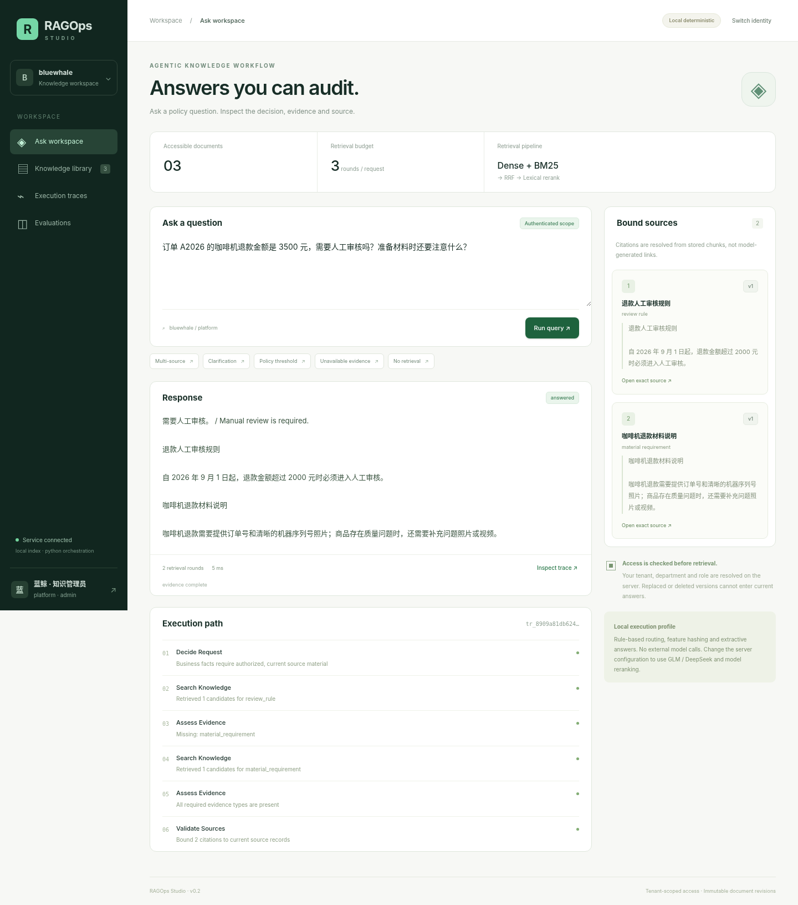

# RAGOps Studio

**Tenant-aware knowledge operations. Answers with a traceable source.**

RAGOps Studio connects a bounded evidence-seeking workflow to a versioned knowledge base. It decides when to retrieve, asks for missing user input, searches only authorized sources, and refuses answers that cannot be tied to current source records.



## What is implemented

| Workflow | Behavior |
|---|---|
| Ask a policy question | Direct / clarify / retrieve routes; additional search only for missing evidence; bounded stopping |
| Inspect an answer | Server-bound chunk IDs, source text, revision, retrieval scores and execution trace |
| Manage knowledge | Markdown-aware chunking, SHA-256 change detection, immutable revision files, atomic active-version switch, soft deletion |
| Enforce scope | Server-issued credentials, tenant isolation, company/department visibility, administrator-only writes |
| Choose retrieval infrastructure | Local BM25 + vector/RRF pipeline; native Milvus BM25/dense hybrid adapter; preserved Qdrant alternative |
| Choose model providers | Zhipu embeddings/rerank/chat; DeepSeek chat; preserved OpenAI-compatible alternative |
| Check regressions | Deterministic behavior/security tests; small document-level evaluation set; explicit external integration tests |

This release consolidates the supplied **08-agentic-rag** and **12-enterprise-knowledge-base** implementations into the existing RAGOps codebase. It is a public engineering project with a **synthetic reference corpus**, not a representation of a customer deployment or a production accuracy benchmark.

## Run locally

Python 3.11+ is required; the supplied validation was executed with Python 3.13. The compiled TypeScript web client is included, so Node is not required just to run the application.

```bash
python3 -m venv .venv
source .venv/bin/activate
# Windows PowerShell: .venv\Scripts\Activate.ps1
python -m pip install -r backend/requirements-dev.txt
cp .env.example .env
python scripts/bootstrap.py --with-sample-data
python scripts/serve.py
```

Open `http://127.0.0.1:8000`. Copy a locally generated credential from `.secrets/access-credentials.txt` into the sign-in form. Start with **agentic-admin** to exercise the multi-source refund scenario. Credentials are random per installation; the server stores only their SHA-256 digests. Do not commit, share or record the plaintext credential file.

The default profile performs **real ingestion, BM25/vector retrieval, RRF fusion, access checks, revision updates and API calls to the local service**. Its router is rule-based, embeddings use feature hashing, reranking is lexical, and answers are extractive. It does **not** emulate a remote LLM, a learned semantic embedding model or a running Milvus service. The UI explicitly displays the selected runtime.

## Select the LangGraph / Milvus / Zhipu profile

Install optional SDKs, start the supplied local Milvus integration stack, then configure the server:

```bash
python -m pip install -r backend/requirements-integrations.txt
docker compose -f infra/milvus.compose.yml up -d
```

Example `.env` choices:

```dotenv
RAGOPS_GRAPH_ENGINE=langgraph
RAGOPS_MODEL_PROVIDER=zhipu
RAGOPS_EMBEDDING_PROVIDER=zhipu
RAGOPS_RERANK_PROVIDER=zhipu
RAGOPS_VECTOR_BACKEND=milvus
ZHIPU_API_KEY=<your-account-key>
CHAT_MODEL=glm-4.7-flash
EMBEDDING_MODEL=embedding-3
RERANK_MODEL=rerank
EMBEDDING_DIMENSIONS=512
MILVUS_URI=http://127.0.0.1:19530
RAGOPS_STATE_DIR=./.state-zhipu
VECTOR_COLLECTION=ragops_zhipu_v2
```

The model names above come from the supplied references; confirm that your own provider account has access. Re-run bootstrap in the new state directory before starting the service. An incompatible embedding/index fingerprint is rejected rather than silently reusing stale vectors. Selecting an unavailable SDK, key or service fails explicitly—there is no hidden fallback.

Use `RAGOPS_MODEL_PROVIDER=deepseek`, `DEEPSEEK_API_KEY` and an explicitly selected `CHAT_MODEL` to use the chat provider from reference 08. Embeddings and reranking remain separately configured.

## Verification

```bash
python -m pytest -q
# Rebuild the typed web client after source changes:
npm install --prefix frontend
npm run build --prefix frontend
```

Recorded validation and its limits are in [docs/VALIDATION.md](docs/VALIDATION.md). Tests distinguish offline behavior, HTTP provider contracts, and live external integration. Optional integration tests are skipped without their explicit prerequisites. No cloud-model or production-service result is inferred from a local pass.

## Repository map

```text
backend/app/
  api/           request validation and authenticated HTTP routes
  core/          identities, configuration, chunks and retrieval primitives
  services/      document store, model/index adapters, graph and evaluation
frontend/src/    typed web client: ask, sources, traces, evaluations
frontend/dist/   compiled client served by the same FastAPI process
scripts/        explicit bootstrap and single-worker startup
backend/tests/  behavior, authorization, lifecycle and integration checks
data/           synthetic reference corpus and explicit update input
infra/          optional local Milvus stack
```

The original React build shell was replaced with a small typed browser client so the portfolio is runnable from one Python process with no frontend runtime service. The backend remains FastAPI; the reference NestJS/Vue applications are not duplicated or advertised as this project's stack.

## Scope and deployment boundary

The unit of deployment is one application process, a SQLite metadata store and one configured vector backend. There is no message queue, distributed ingestion worker, SSO product, agent marketplace or unrelated tool system. New RAG features in this release are limited to the two supplied references. Existing TXT/text-PDF/DOCX ingestion, Qdrant/OpenAI-compatible adapters and retrieval evaluation were retained, not expanded.

Use loopback for local operation. Before hosting publicly, configure HTTPS, protect provider endpoints and secrets, set reverse-proxy request limits, back up state, and verify live integrations in the actual environment. Do not treat the included local MinIO credentials as production credentials. Multi-instance operation and immediate revocation of already in-flight remote model context are outside this release's guarantees.

## Further reading

- [Source-to-implementation map](docs/REFERENCE-MAP.md)
- [Architecture and consistency decisions](docs/architecture.md)
- [Operation and provider setup](docs/OPERATIONS.md)
- [A short, repeatable walkthrough](docs/walkthrough.md)
- [Portfolio and resume wording](docs/portfolio-copy.md)
