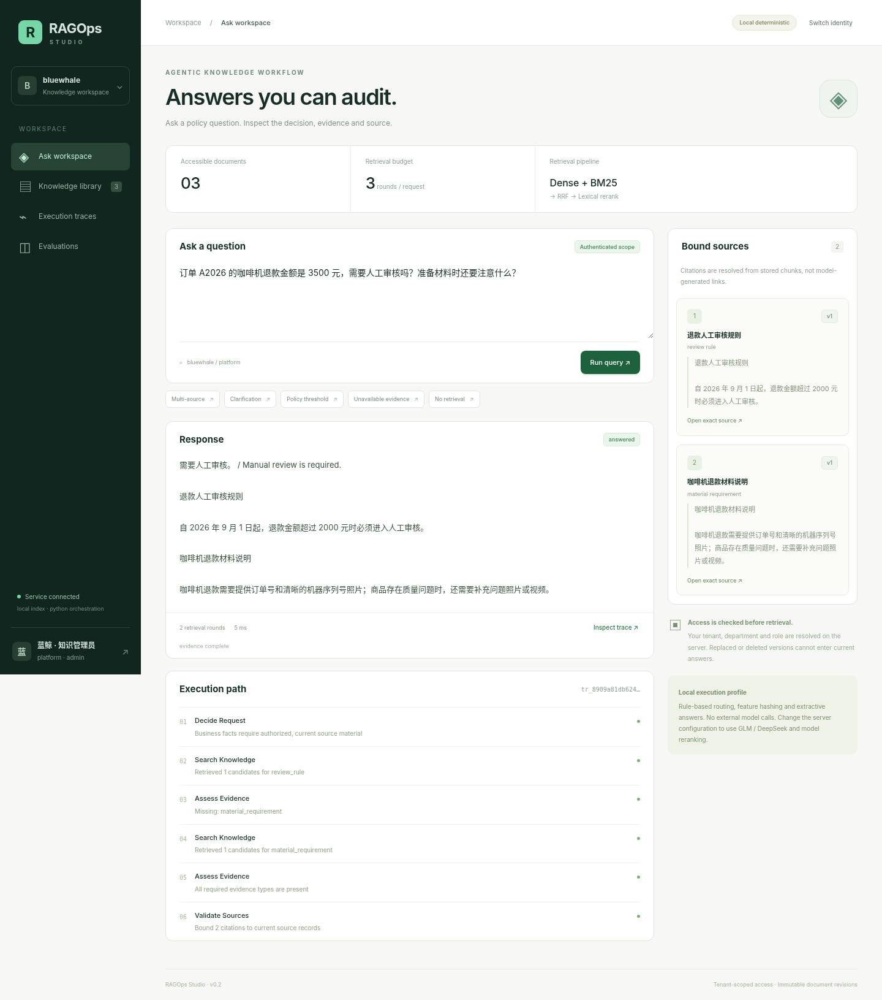

# RAGOps Studio

**Enterprise knowledge workflows with governed sources, inspectable retrieval, and verifiable citations.**

RAGOps Studio is a runnable enterprise RAG application with a React operations console and a FastAPI backend. Manage knowledge sources, inspect how an answer was retrieved, and verify its citations against the current documents the user is authorized to read.

The workflow chooses between a direct response, a clarification and knowledge retrieval. It checks supporting evidence, searches again when needed within a fixed budget, and refuses business conclusions that cannot pass source validation. The application can run as one server service with a compiled web console.



## Core capabilities

| Area | Implementation |
|---|---|
| Agentic retrieval | Direct / clarify / retrieve routes, relevance checks, one bounded query revision and explicit stop conditions |
| Grounded answers | Server-bound chunk IDs, exact source text, source revision and citation validation |
| Hybrid search | Dense + BM25 retrieval, RRF fusion and optional model reranking |
| Source governance | Structured Word import, table-aware chunking, SHA-256 change detection, immutable revisions, atomic active-version switch and soft deletion |
| Access control | Server-issued credentials, tenant isolation, company/department visibility and administrator-only writes |
| Observability | Search rounds, permission filters, candidate scores, stage timings and execution traces |
| Evaluation | Deterministic regression cases with Recall@K, MRR, nDCG@K and keyword coverage |
| Integrations | Milvus native hybrid adapter, Zhipu embeddings/rerank/chat, DeepSeek chat, Qdrant and OpenAI-compatible alternatives |

The included **synthetic demonstration corpus** makes the complete workflow reproducible without customer data. Its evaluation results describe regression behavior on that corpus, not production-model accuracy.

## Explore the application

| Scenario | What to inspect |
|---|---|
| Ask a refund question that needs two sources | Additional retrieval for missing evidence, both citations and the execution trace |
| Ask whether a refund needs review without providing an amount | Clarification before retrieval |
| Ask about an unavailable benefit | Refusal with no unsupported citations |
| Switch between a department employee and an administrator | Permission filters and visible source sets |
| Publish an updated policy | New active revision, retained history and citations bound to the replacement |
| Upload a Word document | Heading and table preservation, retrieval of table values and exact source inspection |

Follow the [guided walkthrough](docs/walkthrough.md) for a repeatable demonstration. The [implementation map](docs/IMPLEMENTATION-MAP.md) connects each capability to its code and verification.

## Architecture

```text
React 19 + TypeScript + Vite
            │
            │ /api
            ▼
        FastAPI
            │
      Agentic workflow
    ┌───────┼────────┐
    │       │        │
  ACL    Retrieval  Trace
            │
   Dense + BM25 → RRF → Rerank
            │
     Versioned knowledge store
            │
      Local / Milvus / Qdrant
```

The frontend and API are developed independently, while the production build is deployed as a single application unit: Vite emits `frontend/dist`, and FastAPI serves those static assets alongside the API.

## Run locally

### 1. Backend

Python 3.11+ is required; CI validates with Python 3.13.

```bash
python3 -m venv .venv
source .venv/bin/activate
# Windows PowerShell: .venv\Scripts\Activate.ps1
python -m pip install -r backend/requirements-dev.txt
cp .env.example .env
python scripts/bootstrap.py --with-sample-data
python scripts/serve.py
```

The API is available at `http://127.0.0.1:8000`.

### 2. Frontend development

Node 20.19+ is required.

```bash
npm install --prefix frontend
npm run dev --prefix frontend
```

Vite runs at `http://127.0.0.1:5173` and proxies `/api` and `/health` to the FastAPI process.

### 3. Production-style local build

```bash
npm install --prefix frontend
npm run build --prefix frontend
python scripts/serve.py
```

After the Vite build, open `http://127.0.0.1:8000`. FastAPI serves the compiled React application from `frontend/dist`.

Copy a locally generated credential from `.secrets/access-credentials.txt` into the sign-in form. Start with **agentic-admin** to exercise the multi-source refund scenario. Credentials are random per installation; the server stores only SHA-256 digests. Do not commit, share or record the plaintext credential file.

The default profile performs real ingestion, BM25/vector retrieval, RRF fusion, access checks, revision updates and local API calls. Its router is rule-based, embeddings use feature hashing, reranking and relevance checks are lexical, and answers are extractive. Local query revision only removes question framing; it does not invent synonyms or facts. It does **not** emulate a remote LLM, a learned semantic embedding model or a running Milvus service. The selected runtime is shown in the UI.

Word uploads preserve body order, heading levels, list items and tables in the stored Markdown. Long tables repeat their headers across chunks; oversized rows fail before replacing a published revision. A synthetic upload can be generated with `python scripts/create_demo_document.py /tmp/ragops-document-demo.docx` and used in the [document-to-citation walkthrough](docs/walkthrough.md#document-to-citation-demonstration).

## LangGraph / Milvus / Zhipu profile

Install optional SDKs, start the local Milvus stack, then configure the server:

```bash
python -m pip install -r backend/requirements-integrations.txt
docker compose -f infra/milvus.compose.yml up -d
```

Example `.env` choices:

```dotenv
RAGOPS_GRAPH_ENGINE=langgraph
RAGOPS_MODEL_PROVIDER=zhipu
RAGOPS_EMBEDDING_PROVIDER=zhipu
RAGOPS_RERANK_PROVIDER=zhipu
RAGOPS_VECTOR_BACKEND=milvus
ZHIPU_API_KEY=<your-account-key>
CHAT_MODEL=glm-4.7-flash
EMBEDDING_MODEL=embedding-3
RERANK_MODEL=rerank
EMBEDDING_DIMENSIONS=512
MILVUS_URI=http://127.0.0.1:19530
RAGOPS_STATE_DIR=./.state-zhipu
VECTOR_COLLECTION=ragops_zhipu_v2
```

Confirm model availability for your provider account before enabling an external profile. Re-run bootstrap in the new state directory before starting the service. An incompatible embedding/index fingerprint is rejected rather than silently reusing stale vectors. Selecting an unavailable SDK, key or service fails explicitly—there is no hidden fallback.

Use `RAGOPS_MODEL_PROVIDER=deepseek`, `DEEPSEEK_API_KEY` and an explicitly selected `CHAT_MODEL` to use the DeepSeek chat provider. Embeddings and reranking remain separately configured.

## Verification

```bash
python -m pip install -r backend/requirements-dev.txt
npm install --prefix frontend
npm run typecheck --prefix frontend
npm run build --prefix frontend
python -m pytest -q
python -m compileall -q backend/app
```

The backend suite can also be run without a frontend build; in that case the one static-bundle integration assertion is skipped. CI builds the React console first, so the full application job exercises that assertion.

Recorded validation and its limits are documented in [docs/VALIDATION.md](docs/VALIDATION.md). Tests distinguish deterministic local behavior, provider contract tests, and opt-in live integrations. No cloud-model or production-service result is inferred from a local pass.

## Repository map

```text
backend/app/
  api/             authenticated HTTP routes and request validation
  core/            identities, configuration, chunks and retrieval primitives
  services/        document store, model/index adapters, graph and evaluation
frontend/src/
  features/        ask, knowledge, trace, evaluation and authentication views
  api.ts           typed API transport and credential handling
  types.ts         API/domain contracts
frontend/dist/     generated Vite production build (not committed)
scripts/           explicit bootstrap, startup and browser verification
backend/tests/     behavior, authorization, lifecycle and integration checks
data/              synthetic demonstration corpus and update fixtures
infra/             optional local Milvus stack
```

## Deployment boundary

The deployable application is one FastAPI service, one compiled React bundle, a SQLite metadata store and one configured vector backend. The Docker image builds the React bundle in a Node stage and copies only the resulting static assets into the Python runtime image.

Before hosting publicly, configure HTTPS, provider secrets, reverse-proxy request limits, state backups and live integration verification in the target environment. Multi-instance coordination, enterprise SSO and distributed ingestion workers are outside the current scope.

## Further reading

- [Implementation and verification map](docs/IMPLEMENTATION-MAP.md)
- [Architecture and consistency decisions](docs/architecture.md)
- [Operations and provider setup](docs/OPERATIONS.md)
- [Repeatable walkthrough](docs/walkthrough.md)

## License

MIT. See [LICENSE](LICENSE). Third-party dependencies retain their respective licenses.
