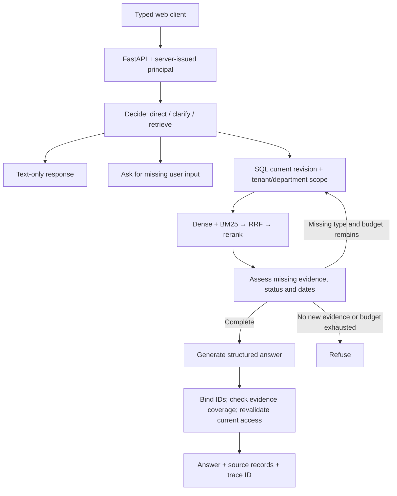

# Architecture and operational invariants

## Request path

The iteration is evidence-seeking, not an unconstrained autonomous agent. By default at most three searches run. The graph does not call business APIs or execute external side effects. A request is single-turn: after clarification, the user resubmits the question with the missing input. Conversation memory and SSE are not implemented.

## Publication path

1. Resolve the administrator from the server credential registry.
2. Validate title, access metadata and timezone-aware validity dates. Normalize Markdown line endings and compute its checksum.
3. Compare against the **active** revision's content and metadata. A previous historical checksum is not considered a no-op.
4. Parse heading-aware chunks. Assign immutable source/chunk identities and generate embeddings once.
5. Stage new chunk IDs in the vector index. They are not yet eligible for retrieval.
6. Write an immutable source file. Use a SQL transaction and an optimistic version precondition to activate the new revision and deactivate the old one.
7. Subsequent retrieval snapshots contain only the new revision. Old source versions remain administrator-readable.

A stage/write failure leaves the old SQL revision active. This is not a distributed transaction or an exactly-once external guarantee. A failed run can leave unreferenced vector records or a source file; the SQL allow-list prevents those records from being used. Rebuilding into a new state/collection is the supported maintenance path for this small installation.

## Access boundary

`tenant_id`, `department_id`, and `role` are never accepted in chat or document bodies. The credential maps to a server-owned principal. Both BM25 and dense retrieval consume the same authorized snapshot. External vector results are checked against that snapshot **before** any text goes to reranking or answer generation.

An administrator can manage their own tenant only. An employee sees company-wide documents and their department's sources. An employee cannot browse historical source revisions, write documents or run the administrator's regression dataset. Traces are restricted to their owner or a same-tenant administrator. Old employee trace bodies and answers are redacted when cited access is revoked.

Authorization is checked again immediately before releasing a cited answer. Data already sent to a remote model during an authorized in-flight request cannot be retroactively withdrawn; this application does not claim otherwise.

## Source validation is deliberately narrower than truth evaluation

The server rejects invented IDs, missing evidence-type coverage and superseded/unauthorized sources. It cannot establish that every generated sentence is entailed by those sources. The local profile quotes retrieved text; the hosted-model profile uses a constrained JSON prompt. Neither is advertised as a proof of factual faithfulness.

## Runtime adapters

- `local`: persisted feature-hashed vectors + BM25 + RRF + lexical reranker, rule router and extractive answerer. No hidden fake success response.
- `milvus`: native dense vector + BM25 sparse function with identical pre-search filters and RRF. Individual leg scores are `null` when the SDK returns only a fused score; the UI shows a dash instead of inventing values.
- `qdrant`: filtered dense ANN with authorized local BM25 and RRF. Preserved compatibility path.
- `langgraph`: the actual StateGraph and StructuredTool over the shared nodes.
- Zhipu: embeddings, rerank and chat. DeepSeek: chat/decision. OpenAI-compatible adapter: preserved embeddings/chat path.

Provider requests have bounded timeouts and retry only transient network errors, HTTP 429 and 5xx. Auth failures are not retried. Provider response bodies and keys are not echoed into user-facing errors. Completed stages survive a later generation failure in the trace.
